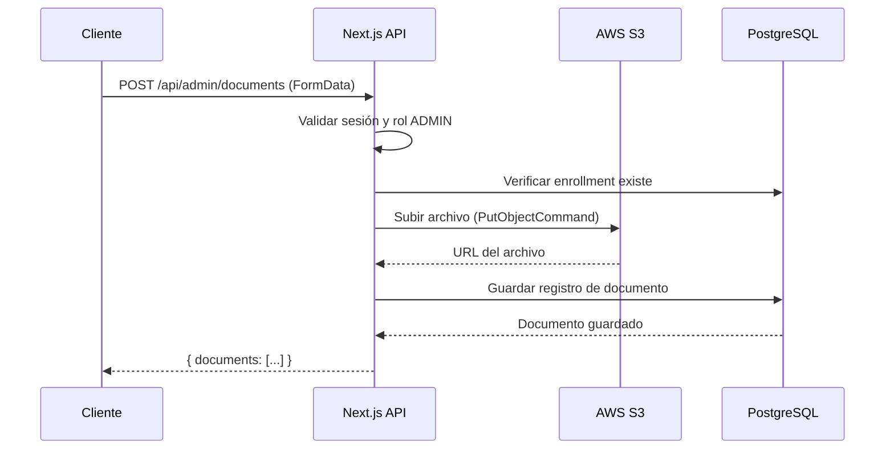

# Sistema de Subida de Documentos a AWS S3

## 📋 Descripción General

Sistema completo para subir documentos (PDFs, imágenes) a AWS S3, similar al sistema de ejercicios. Los documentos se almacenan en S3 y las URLs se guardan en la base de datos PostgreSQL.

---

## 🔧 Configuración

### Variables de Entorno (.env)

```env
# AWS S3 Configuration
S3_BUCKET=tu-bucket-name
AWS_S3_REGION=us-east-1
AWS_ACCESS_KEY_ID=tu-access-key
AWS_SECRET_ACCESS_KEY=tu-secret-key
S3_PRESIGNED_URL_EXPIRES=3600
```

---

## 📡 Endpoints API

### 1. **POST /api/admin/documents** 
Sube documentos directamente a S3 (método actual mejorado)

**Auth:** Requiere rol ADMIN

**Request (FormData):**
```typescript
const formData = new FormData();
formData.append('enrollmentId', 'enrollment-id');
formData.append('dietFile', pdfFile);      // opcional
formData.append('routineFile', pdfFile);   // opcional
formData.append('reportFile', imageFile);  // opcional (JPG/PNG)
```

**Response:**
```json
{
  "message": "Documentos subidos exitosamente a S3",
  "documents": [
    {
      "id": "doc-id",
      "enrollmentId": "enrollment-id",
      "type": "DIET",
      "filename": "dieta.pdf",
      "url": "https://bucket.s3.us-east-1.amazonaws.com/documents/uuid.pdf",
      "fileSize": 1234567,
      "uploadedAt": "2026-01-30T...",
      "updatedAt": "2026-01-30T..."
    }
  ]
}
```

**Tipos de archivo permitidos:**
- Documentos: `application/pdf`, `image/jpeg`, `image/png`, `image/webp`, `image/gif`

---

### 2. **POST /api/uploads/presign**
Genera URL pre-firmada para subir archivo a S3

**Auth:** Requiere rol ADMIN

**Request (JSON):**
```json
{
  "filename": "documento.pdf",
  "contentType": "application/pdf",
  "folder": "documents"  // opcional, default: "documents"
}
```

**Response:**
```json
{
  "uploadUrl": "https://bucket.s3...?X-Amz-Signature=...",
  "fileUrl": "https://bucket.s3.us-east-1.amazonaws.com/documents/uuid.pdf",
  "key": "documents/uuid.pdf",
  "expiresIn": 3600
}
```

**Uso (cliente):**
```typescript
// Paso 1: Obtener URL pre-firmada
const response = await fetch('/api/uploads/presign', {
  method: 'POST',
  headers: { 'Content-Type': 'application/json' },
  body: JSON.stringify({
    filename: file.name,
    contentType: file.type,
    folder: 'documents'
  })
});
const { uploadUrl, fileUrl, key } = await response.json();

// Paso 2: Subir directamente a S3
await fetch(uploadUrl, {
  method: 'PUT',
  headers: { 'Content-Type': file.type },
  body: file
});

// Paso 3: Guardar fileUrl en tu base de datos
```

---

### 3. **POST /api/uploads/document**
Sube archivo directamente a S3 a través del servidor

**Auth:** Requiere rol ADMIN

**Request (FormData):**
```typescript
const formData = new FormData();
formData.append('file', file);
formData.append('folder', 'documents'); // opcional
```

**Response:**
```json
{
  "fileUrl": "https://bucket.s3.us-east-1.amazonaws.com/documents/uuid.pdf",
  "key": "documents/uuid.pdf"
}
```

**Ejemplo de uso:**
```typescript
const formData = new FormData();
formData.append('file', document);
formData.append('folder', 'documents');

const response = await fetch('/api/uploads/document', {
  method: 'POST',
  body: formData
});

const { fileUrl, key } = await response.json();
```

---

### 4. **DELETE /api/uploads/document?key=...**
Elimina archivo de S3

**Auth:** Requiere rol ADMIN

**Request:**
```
DELETE /api/uploads/document?key=documents/uuid.pdf
```

**Response:**
```json
{
  "message": "Archivo eliminado exitosamente"
}
```

---

### 5. **GET /api/uploads/download-url?key=...**
Genera URL pre-firmada para descargar/visualizar documento

**Auth:** Requiere autenticación (admin o cliente)

**Request:**
```
GET /api/uploads/download-url?key=documents/uuid.pdf&expiresIn=7200
```

**Parámetros:**
- `key` (requerido): Key de S3 o URL completa
- `expiresIn` (opcional): Segundos de expiración (60-86400), default: 3600

**Response:**
```json
{
  "downloadUrl": "https://bucket.s3...?X-Amz-Signature=...",
  "key": "documents/uuid.pdf",
  "expiresIn": 3600
}
```

**POST /api/uploads/download-url**
Alternativa POST para obtener URL de descarga

**Request (JSON):**
```json
{
  "keyOrUrl": "documents/uuid.pdf",
  "expiresIn": 7200  // opcional
}
```

---

## 💻 Ejemplos de Uso en Frontend

### Opción 1: Upload Directo a S3 (Recomendado para archivos grandes)

```typescript
async function uploadWithPresignedUrl(file: File) {
  try {
    // 1. Solicitar URL pre-firmada
    const presignResponse = await fetch('/api/uploads/presign', {
      method: 'POST',
      headers: { 'Content-Type': 'application/json' },
      body: JSON.stringify({
        filename: file.name,
        contentType: file.type,
        folder: 'documents'
      })
    });
    
    if (!presignResponse.ok) throw new Error('Error obteniendo presigned URL');
    
    const { uploadUrl, fileUrl, key } = await presignResponse.json();
    
    // 2. Subir directamente a S3
    const uploadResponse = await fetch(uploadUrl, {
      method: 'PUT',
      headers: { 'Content-Type': file.type },
      body: file
    });
    
    if (!uploadResponse.ok) throw new Error('Error subiendo a S3');
    
    console.log('Archivo subido exitosamente:', fileUrl);
    return { fileUrl, key };
    
  } catch (error) {
    console.error('Error:', error);
    throw error;
  }
}
```

### Opción 2: Upload a través del Servidor (Actual)

```typescript
async function uploadThroughServer(
  enrollmentId: string,
  files: { 
    diet?: File, 
    routine?: File, 
    report?: File 
  }
) {
  const formData = new FormData();
  formData.append('enrollmentId', enrollmentId);
  
  if (files.diet) formData.append('dietFile', files.diet);
  if (files.routine) formData.append('routineFile', files.routine);
  if (files.report) formData.append('reportFile', files.report);
  
  const response = await fetch('/api/admin/documents', {
    method: 'POST',
    body: formData
  });
  
  if (!response.ok) {
    const error = await response.json();
    throw new Error(error.error || 'Error subiendo documentos');
  }
  
  return await response.json();
}
```

### Opción 3: Upload Individual con /api/uploads/document

```typescript
async function uploadSingleDocument(file: File, folder = 'documents') {
  const formData = new FormData();
  formData.append('file', file);
  formData.append('folder', folder);
  
  const response = await fetch('/api/uploads/document', {
    method: 'POST',
    body: formData
  });
  
  if (!response.ok) throw new Error('Error al subir documento');
  
  const { fileUrl, key } = await response.json();
  return { fileUrl, key };
}
```

### Descargar/Visualizar Documento

```typescript
async function getDocumentDownloadUrl(s3Url: string) {
  const response = await fetch('/api/uploads/download-url', {
    method: 'POST',
    headers: { 'Content-Type': 'application/json' },
    body: JSON.stringify({
      keyOrUrl: s3Url,
      expiresIn: 3600  // 1 hora
    })
  });
  
  if (!response.ok) throw new Error('Error obteniendo URL de descarga');
  
  const { downloadUrl } = await response.json();
  
  // Abrir en nueva pestaña o descargar
  window.open(downloadUrl, '_blank');
  
  return downloadUrl;
}
```

---

## 🔐 Seguridad

1. **Autenticación**: Todos los endpoints requieren sesión válida
2. **Autorización**: Upload requiere rol ADMIN
3. **Validación de tipos**: Solo se permiten tipos de archivo específicos
4. **URLs pre-firmadas**: Expiran automáticamente (default: 1 hora)
5. **Keys únicas**: Cada archivo tiene un UUID único

---

## 📊 Flujo Completo



---

## 🗂 Estructura de Carpetas en S3

```
bucket-name/
├── exercises/           # Imágenes de ejercicios
│   ├── uuid1.jpg
│   ├── uuid2.png
│   └── ...
└── documents/           # Documentos de clientes
    ├── uuid1.pdf       # Dietas
    ├── uuid2.pdf       # Rutinas
    ├── uuid3.jpg       # Reportes
    └── ...
```

---

## 🐛 Troubleshooting

### Error: "Tipo de archivo no permitido"
Verifica que el `contentType` sea uno de los permitidos:
- PDFs: `application/pdf`
- Imágenes: `image/jpeg`, `image/png`, `image/webp`, `image/gif`

### Error: "AWS credentials not found"
Verifica que las variables de entorno estén configuradas correctamente en `.env`

### Error de CORS al subir a S3
Configura CORS en tu bucket S3:
```json
[
  {
    "AllowedHeaders": ["*"],
    "AllowedMethods": ["GET", "PUT", "POST"],
    "AllowedOrigins": ["https://tu-dominio.com"],
    "ExposeHeaders": []
  }
]
```

---

## 📝 Notas Importantes

1. **Migración desde almacenamiento local**: Los documentos existentes en `/public/uploads/documents` pueden permanecer ahí. Los nuevos se subirán a S3.

2. **Costos de S3**: Las URLs pre-firmadas no tienen costo adicional, solo el almacenamiento y transferencia de datos.

3. **Límites**: 
   - Tamaño máximo de archivo: Depende de tu configuración de Next.js (default 4.5MB)
   - Duración de presigned URL: 60-86400 segundos (1 min - 24 horas)

4. **Performance**: Para archivos >5MB, se recomienda usar presigned URLs (upload directo del cliente a S3)

---

## ✅ Ventajas de este Sistema

- ✅ **Escalable**: S3 maneja millones de archivos
- ✅ **Seguro**: URLs pre-firmadas con expiración
- ✅ **Rápido**: Upload directo del cliente a S3
- ✅ **Confiable**: Redundancia de AWS
- ✅ **Económico**: Pago por uso
- ✅ **Compatible**: Funciona con el sistema actual
